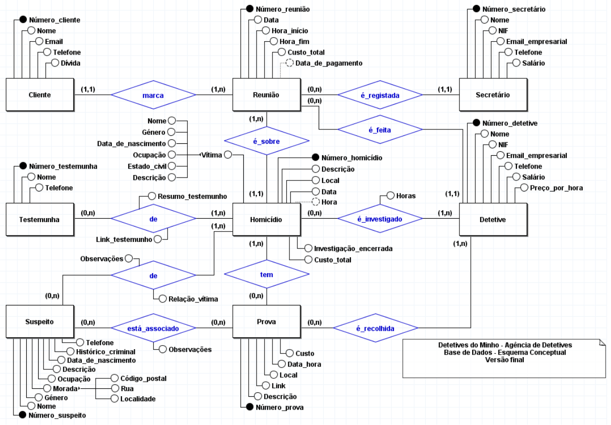
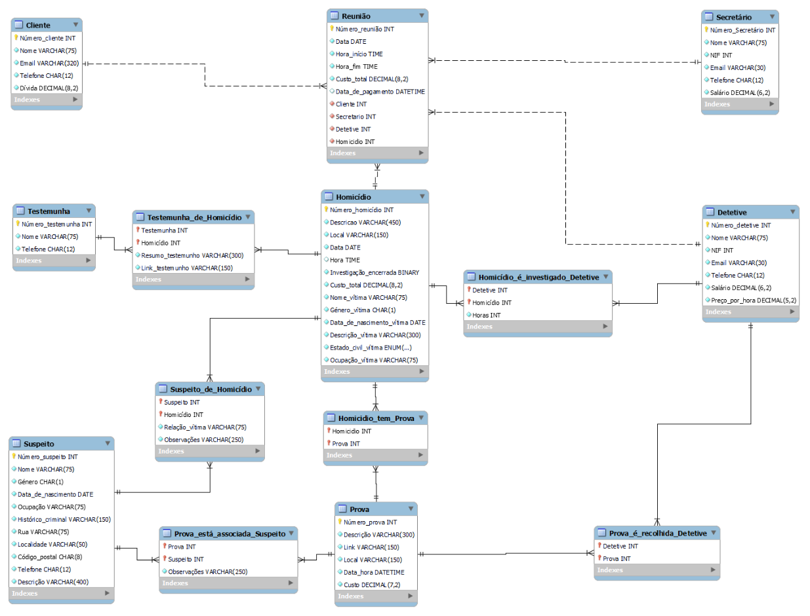
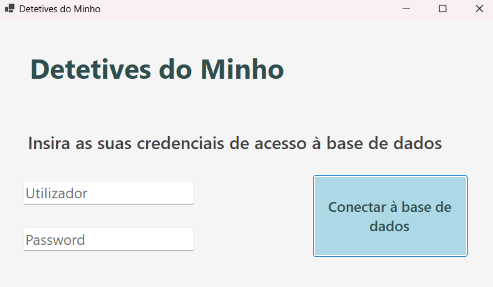

# Detetives do Minho 🕵🏻‍♀️🕵🏻‍♂️
## Projeto de BD

Projeto desenvolvido por nós no âmbito da Unidade Curricular de **Bases de Dados** (**BD**) no ano letivo de 2023/2024. Desenvolvemos um **sistema de bases de dados** para os **Detetives do Minho**, uma pequena agência de detetives que lida essencialmente com casos de homicídios na região do Minho. Utilizamos o **MySQL Workbench** e o **MySQL**, recorrendo à linguagem **SQL** para manipular e consultar a base de dados. Fizemos ainda uma pequena aplicação usando **C#**.

### Nota final: 19 ✅
##### Modelo conceptual

##### Modelo lógico

##### Aplicação

## Projeto desenvolvido

O trabalho desenvolvido está descrito no seguinte relatório: [Relatório Grupo 33.pdf](Relatório%20Grupo%2033.pdf).

Na pasta [Scripts SQL](Scripts%20SQL) encontram-se os scripts SQL utilizados no desenvolvimento do trabalho.

Na pasta [AppPovoamento_código](AppPovoamento_código) está o código da aplicação responsável por povoar parcialmente a base de dados.

Na pasta [AppPovoamento_executável](AppPovoamento_executável) encontra-se o executável da aplicação mencionada anteriormente: [DetetivesDoMinho.exe](AppPovoamento_executável/AppPovoamento/DetetivesDoMinho.exe).

## Autores
### Grupo 33
- [Ana Sá Oliveira](https://github.com/a104437ana) (a104437)
- Inês Silva Marques (a104263)
- José Rafael de Oliveira Vilas Boas (a76350)
- Sara Campos Ramalho (a72481)